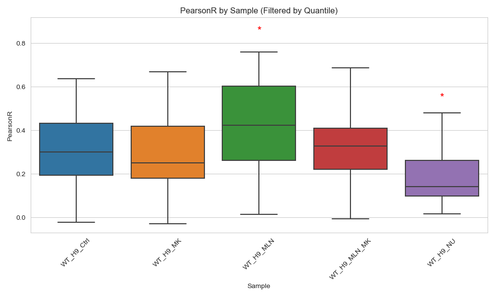
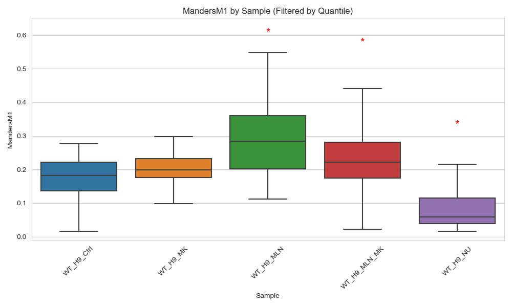
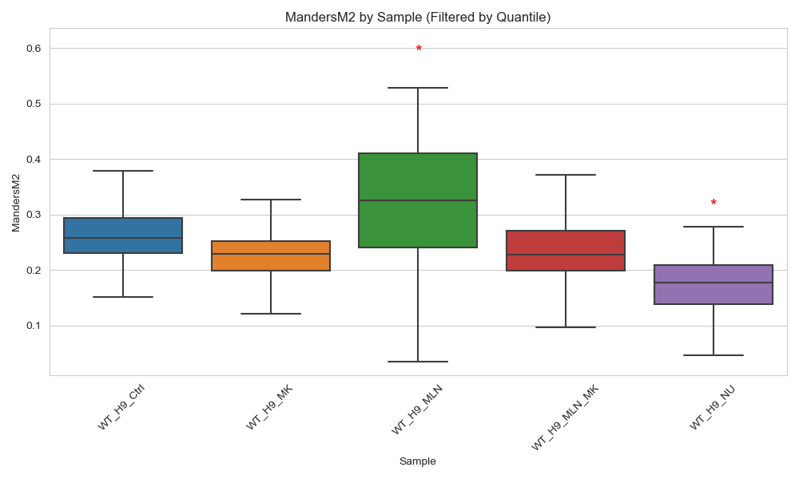

# Nuclear_Colocalization

# **Pixel Intensity Distributions & Colocalization Results**

This pipeline performs **segmentation of nuclei** using CZI-formated microscopy images, **quantifies colocalization** between PCNA and GFP markers, and **summarizes results** across biological conditions. It also includes **statistical testing**, **visualization**, and **exporting high/low scoring examples** for interpretation.

---

## **Folder Structure**

+ `wt_czi_images/` — Root input folder with subfolders per sample (e.g., `WT_H9_Ctrl/`, `WT_H9_MK/`, etc.)
+ `results_wt/` — Output directory where all processed results, plots, and summary files are saved

---

## **Sample Conditions**

+ `WT_H9_Ctrl`
+ `WT_H9_MK`
+ `WT_H9_MLN`
+ `WT_H9_MLN_MK`
+ `WT_H9_NU`

---

## **Processing Workflow**

+ **Loads .czi images** using AICSImageIO and extracts 3-channel data:
  + Channel 0: DAPI (nuclear)
  + Channel 1: PCNA
  + Channel 2: GFP

+ **Segments nuclei** from the DAPI channel using:
  + Gaussian smoothing
  + Otsu threshold
  + Morphological filtering

+ For each nucleus:
  + Extracts PCNA & GFP pixel values
  + Computes:
    + **Pearson Correlation Coefficient**
    + **Manders M1 & M2 Coefficients**
  + Saves raw data to CSV

+ **Combines all metrics** into:
  + `results_wt/combined_coloc_results.csv`

---

## **Generated Visualizations**

+ **Pixel Intensity Boxplots**
  + Show distribution of intensities for each channel per sample
  + Saved in `results_wt/` as:
    + `nuclear_pixel_boxplot.png`
    + `pcna_pixel_boxplot.png`
    + `gfp_pixel_boxplot.png`

+ **Colocalization Metrics Boxplots**
  + With overlaid strip plots
  + Saved in `results_wt/` as:
    + `pearson_boxplot.png`
    + `mandersM1_boxplot.png`
    + `mandersM2_boxplot.png`

+ **Histograms of Metrics (Normality)**
  + For each metric across all samples:
    + `pearsonr_histograms.png`
    + `mandersm1_histograms.png`
    + `mandersm2_histograms.png`

+ **ANOVA Boxplots with Significance Annotations**
  + Results saved in:
    + `pearsonr_anova_boxplot.png`
    + `mandersm1_anova_boxplot.png`
    + `mandersm2_anova_boxplot.png`
  + Example images:
    + 
    + 
    + 

---

## **Representative Nucleus Images**

+ For each sample, the top and bottom 3 nuclei by Pearson correlation are visualized
+ Each output is saved as a multi-page `.tif` file containing:
  + Nuclear channel (grayscale)
  + PCNA channel (magma colormap)
  + GFP channel (green colormap)
  + RGB overlay (DAPI in gray, PCNA in red, GFP in green)

+ **Kept nuclei examples** (high-quality segmentation and included in analysis):
  + 
  + 

+ **Removed nuclei examples** (excluded due to segmentation errors or thresholding):
  + 
  + 

---

## **Statistical Analysis**

+ **ANOVA + Tukey HSD** performed for each metric across samples
+ Outputs include:
  + **Normality check** (Shapiro-Wilk)
  + **Equal variance check** (Levene’s test)
  + **Post-hoc comparisons** with Tukey HSD

+ Significant differences from control (`WT_H9_Ctrl`) are annotated with red asterisks on plots.

---

## **Exported Nucleus TIFFs**

+ TIFFs for individual nuclei saved in the same sample folder as the original CZI
+ Example outputs:
  + `wt_czi_images/WT_H9_Ctrl/WT_H9_Ctrl_Image 9_Nuc1_Pearson-0.229.tif`
  + `wt_czi_images/WT_H9_Ctrl/WT_H9_Ctrl_Image 68_Nuc1_Pearson0.628.tif`

---

## **Dependencies**

+ `numpy`, `pandas`, `matplotlib`, `seaborn`
+ `aicsimageio`
+ `scikit-image`
+ `scipy`
+ `statsmodels`
+ `tifffile`

---

## **Run Instructions**

```bash
python pixel_colocalization_analysis.py
```

+ Place `.czi` files in subfolders under `wt_czi_images/` named after the sample condition
+ Modify `sample_of_interest` or `num_examples` to control output behavior
+ Results saved to `results_wt/`

---

## **Contact**

For questions or contributions, please contact the repository maintainer.
